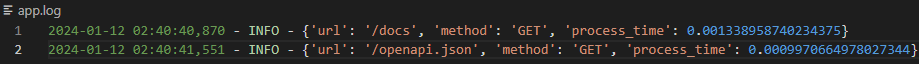
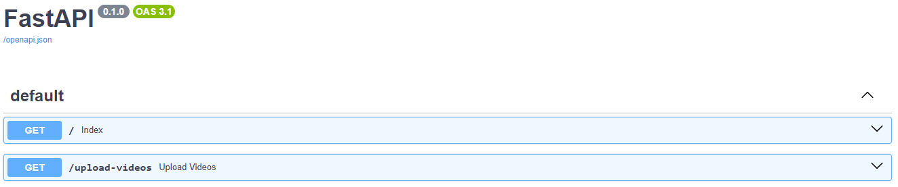
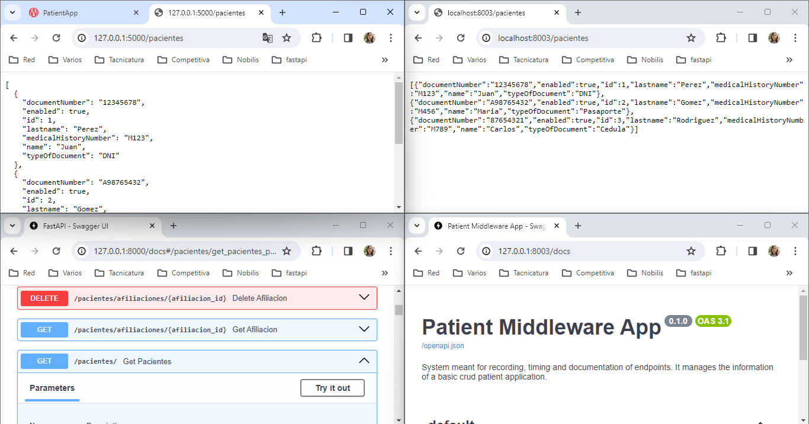

# PatientAppMiddleware

System meant for recording, timing and documentation of endpoints. It manages the information of a basic crud patient application.   
Python + FastAPI, json file is used for storing patients.   

## Commands
`python -m venv api-env` Create local python environment  
`.\api-env\Scripts\activate` Activate it   
`pip install fastapi`  
`pip install sqlalchemy`  
`pip install uvicorn`  
`uvicorn app:app --port 8003` Run the application

## Logs
From [BetterStack](https://betterstack.com/community/guides/logging/best-python-logging-libraries/), visit [logs UI](https://logs.betterstack.com/team/238661/sources/639217/edit). 
token: FrH19SS8aswmGE5LXQeRoEa4 (trial)  
`pip3 install logtail-python`  
Records can be found on app.log file or it can also be easily configured to be displayed on console. There's a third pendind option to visualize results on the Better Stack page but it does't work yet. Registration needed. <br

## Endpoints Docs
[Interface](http://localhost:8000/docs#/)

# Back Connection
